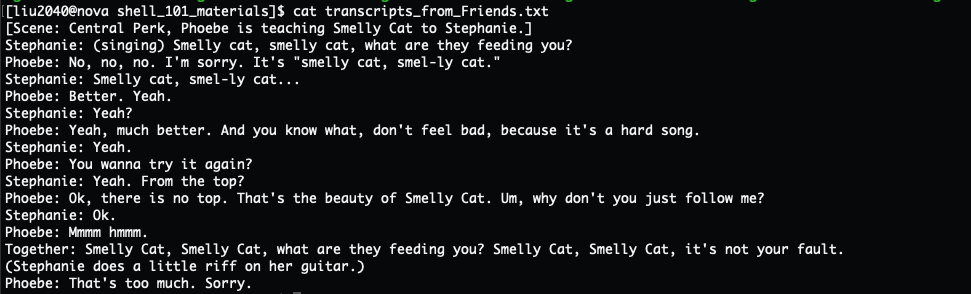
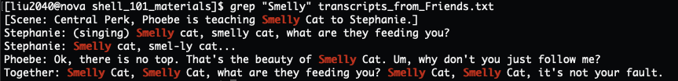
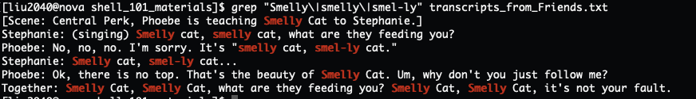
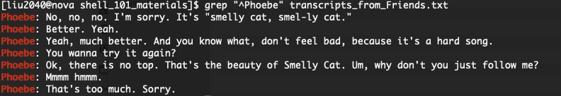
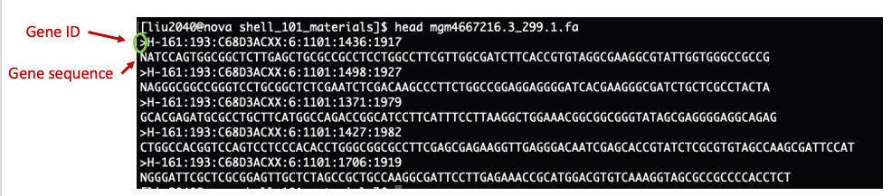
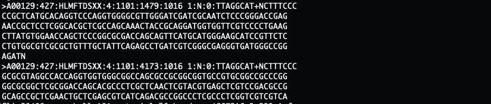
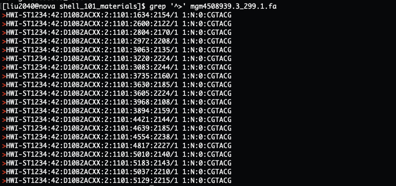

---- 

Author: Jia Liu    

Date: 11/30/2023

----

<br>


# <font color="red">Navigating on the cluster</font>

<br>

## Print Working Directory (`pwd`)

<br>

Now you have logged into the Nova cluster. But where are you? You can print the current working directory you are at through the command below:

```
pwd
```

The response to this command is `/home/YOUR_ISU_NETID`, and this is your home directory, where you can work on or develop your projects at.


<br>


## List the files and directories in the current working directory (`ls`)

You know which directory you are at now. What are the contents of the current directory? You can list the files and directories in a directory by `ls DIRECTORY_PATH`. If no directory path is passed to `ls`, it will by default list all the contents within the current working directory. `.` represents the current working directory, if `.` is passed to `ls`, all the contents in the current working directory will be listed as well:

```
ls
```

or:

```
ls .
```


If this is the first time you logged in, the `ls` command may not return any results in your home directory, since you have not created any contents yet.


The path of our lab directory is `/work/adina`, we can list all the content within the lab directory by:

```
ls /work/adina
```


<br>

## Change to another directory (`cd`)

There are many different directories on the HPC. You can change to another directory by `cd <DIRECTORY_PATH>`. Let's go to our lab directory:

```
cd /work/adina
```

Now if you type `ls` to list all the contents in our lab directory, you can see some folders and files.


There are some shorthand ways to navigate across the file systems through `cd`. For example, we can move up one directory with `..`:

```
cd ..
```

Now we are in the `/work` directory. If you list the contents in this directory, you can see folders belong to many other labs, and `adina` is one of them.


we can go back to our home directory by using `~`:

```
cd ~
```

If you type `pwd` now, you can see you are back at your home directory (`/home/ISU_netID`).

<br>

# <font color="orange">Working with files</font>

<br>

## Creating a new directory

We can create a new directory using the `mkdir NEW_DIRECTORY`. For example, we can create a directory called `test_dir` by:

```
mkdir test_dir
```


Let's create a directory called `practice_working_with_files` through:

```
mkdir practice_working_with_files
```

Let's go to the new created directory through:

```
cd practice_working_with_files
```

Let's check what directory we are currently in using `pwd`.

<br>


## Writing to, displaying, and counting files


- Writing to a file through `echo` and `>`

`echo` is a command that echoes back or prints whatever we supply to it. For example:

```
echo "Hello world"
```

Output:

```
Hello world
```

Another example:

```
echo "happy Friday!"
```

Output:

```
happy Friday!
```


The `>` character takes the output on the left hand side command and saves it to the file on the right hand side. So, if we wanted to save the phrase “First sentence” to `file_1.txt`, we would type:

```
echo "First sentence" > file_1.txt
```


Now if you list the contents in the current folder using `ls`, you should see the `file_1.txt` we just created. 

- Displaying or printing out the contents of a file

We can display everything in a file using `cat FILE_NAME`. Let's print out the contents of the `file_1.txt` we just created:

```
cat file_1.txt
```

Output:

```
First sentence
```


- Append text to an existing file


Note: While using `echo "TEXT" > FILE_NAME` to write text into a file, if the file you put on the right hand side already exists, it will overwrite its contents with whatever you’re putting there.

For example, if we write "New line" to the `file_1.txt` that we just created:

```
echo "New line" > file_1.txt
```

And print out the contents in this file:

```
cat file_1.txt
```

Output:

```
New line
```


The `file_1.txt` is overwritten with the "New line". What if we want to append more texts to an existing file without removing the previous contents? We can use `echo "TEXT"` with `>>`. For example, append "The second line" to `file_1.txt`:

```
echo "The second line" >> file_1.txt
```

Now let's display all the contents in `file_1.txt`:

```
cat file_1.txt
```

Output:

```
New line
The second line
```

Let's add another line:

```
echo "The third line" >> file_1.txt
```

Now let's display all the contents in `file_1.txt`:

```
cat file_1.txt
```

Output:

```
New line
The second line
The third line
```

- Counting a file

We can count a file using `wc`. For example:

```
wc file_1.txt
```

The first value is the number of lines in the file, the second is the number of words, and the third is the size of the file in memory.

If you only want to know the number of lines in a file, you can use `wc -l FILE_NAME`:

```
wc -l file_1.txt
```


<br>


## Copying file and directory

<br>

### Copying file

We can copy a file using `cp`. We first pass the name of the file we want to copy, followed by the location of where we want to copy it to. For instance, to copy the `file_1.txt` file to our home directory, we can type:

```
cp file_1.txt ~
```

Now let's list all the contents in the home directory:

```
ls ~
```


We can also rename the file at the time of copying by supplying a new file name. For example, to copy `file_1.txt` inside the same directory and rename it `file_2.txt`, we would type:

```
cp file_1.txt file_2.txt
```

If we print out the contents from both files, we can see they are the same:

```
cat file_1.txt file_2.txt
```
<br>

### Copying directory

Different from copying file, copying directory uses `cp -r` instead of `cp`. Let's copy the directory for this workshop `/work/adina/liu2040/shell_101_materials` to your home directory `~`:

```
cp -r /work/adina/liu2040/shell_101_materials ~
```

<br>


## Removing file and directory

Let's first navigate to your home directory and list all the contents in it:

```
cd ~
```

then 

```
ls
```

<br>


### Remove file

We can remove file using `rm FILE_NAME`. For example, let's remove the `file_1.txt`:

```
rm file_1.txt
```

If we list all the content now using `ls`, we can see `file_1.txt` is gone.

<br>


### Remove directory

We will use `rm -rf DIRECTORY_NAME` to remove the directory. Let's remove the `test_dir`:

```
rm -rf test_dir
```

<br>


# <font color="green">Searching files with `GREP`</font>


Let's first go to the `shell_101_materials` folder in our home directory:

```
cd ~/shell_101_materials

ls
```

<br>


## Search for specific patterns in a file

We can see there is a file called `transcripts_from_Friends.txt`. If we display the content in this file we can see it's part of the transcripts from the TV show Friends, where Phoebe is teaching Stephanie her song *Smelly Cat*:

```
cat transcripts_from_Friends.txt
```

Output:

{width=100%}

What to do if I want to search all the words "Smelly" in this file? `grep "PATTERN" FILE_NAME` is the function to go. We can search all the appearances of `Smelly` in the file `transcripts_from_Friends.txt` through:

```
grep "Smelly" transcripts_from_Friends.txt
```


Output:

{width=100%}


`grep` found all the `Smelly` in this file. Notice that most of the functions in Shell are case-sensitive, which means our command above will only return **Smelly** as that was what we searched; so even there are some **smelly** in the file, `grep` will not return these patterns. 


There are also some "smel-ly" in the file. What if we want to capture multiple patterns in a file, say all the **Smelly**, **smelly**, and **smel-ly** in this file? `grep` can search more than one pattern in a file, where the patterns need to be separated by `\|`, so the command will look like this: `grep "PATTERN_1\|PATTERN_2" FILE_NAME`. For example, we can find the appearances of "Smelly", "smelly" and "smel-ly" in the file `transcripts_from_Friends.txt` by:

```
grep "Smelly\|smelly\|smel-ly" transcripts_from_Friends.txt 
```


Output:

{width=100%}
<br>

## Search the patterns that locate at the beginning of the lines

`grep` allows you to search the patterns more specifically. For example, only find those patterns that locate at the beginning of the lines by "^PATTERN", the "^" symbol defines at the beginning of a line. In the case of the `transcripts_from_Friends.txt`, we can find all the transcripts from Phoebe (where Phoebe's name will be at the beginning of the lines) through:

```
grep "^Phoebe" transcripts_from_Friends.txt
```

{width=100%}


<br>

### Exercise

**Useful information:**

If you `ls` the content in the current directory, you can see 8 sample metagenome files in addition to the `transcripts_from_Friends.txt`. You can view the first 10 lines of a file using the `head FILE_NAME`. Let's have a look at the first few lines of `mgm4667216.3_299.1.fa`:

```
head mgm4667216.3_299.1.fa
```

Output:

{width=100%}


Above is how a DNA file typically look like. There will be lines that starts with a ">" symbol, which are the gene ID lines that tell you the name and sometimes more descriptions about the genes. The gene ID line will then followed by the nucleotide sequence of the corresponding gene. The sequence often only takes one line as shown above, but it may sometimes take multiple lines as shown in the below:

{width=100%}


So normally, when we want to count how many genes are there in a DNA file, we will count the number of gene ID lines, the ones that start with `>`, in that file. 

**Question:** how many genes are there in the file `mgm4508939.3_299.1.fa`?

**Hint:**

- Search all the lines in `mgm4508939.3_299.1.fa` that starts with the pattern `>`, and save the returned gene ID lines into a file with the name of your choice

- Count the number of lines of the file from the last step


<br>

### Solution

<br>

#### Key 1

```
grep '^>' mgm4508939.3_299.1.fa > mgm4508939.3_299.1_geneIDs.txt
```

```
wc -l mgm4508939.3_299.1_geneIDs.txt
```

<br>


#### Key 2


Notice that our goal for this problem is to get the total number of genes within the file `mgm4508939.3_299.1.fa`. Key 1 did the job, but created an extra file `mgm4508939.3_299.1_geneIDs.txt` that we may never use in the future. `grep '^>' mgm4508939.3_299.1.fa` returns all the gene ID lines that start with `>` in the file, is there a way that we can directly pass the returned lines to the next function `wc -l` for counting, without saving them to a file first?

{width=100%}


Yes, there is! You can use `|` to pass the output from the command on its left, to the command on its right. So in this case, we can pass the output of `grep '^>' mgm4508939.3_299.1.fa` to the `wc -l` command through:

```
grep '^>' mgm4508939.3_299.1.fa | wc -l
```

Output:

```
20
```